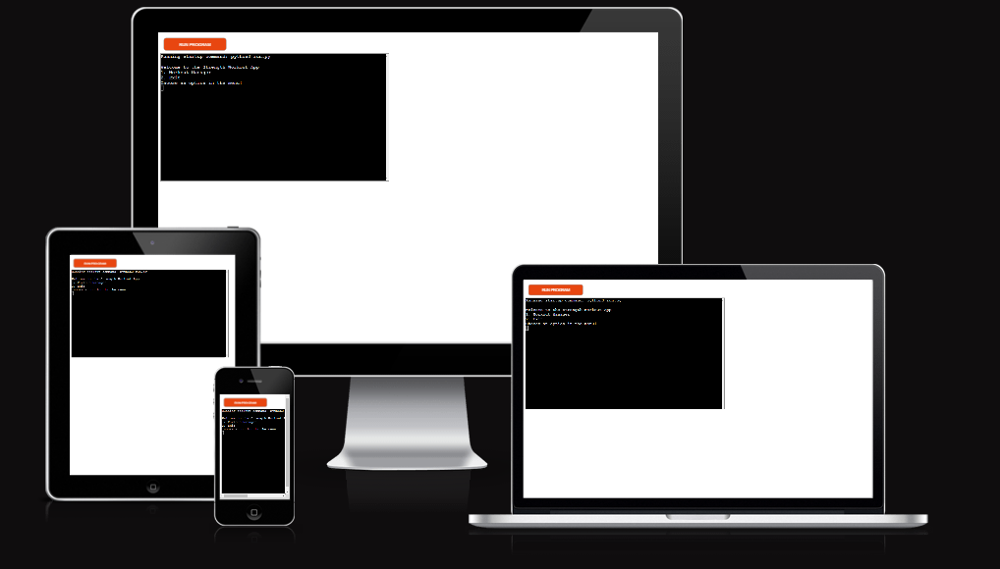

# Strength Workout App

The Strength Workout App is an application to register your workout data.
You will register the exercises, sets, reps and weight in kg to the app, which will transfer to a Google Sheet.

# UX
### Visitor Goals
The expected visitor is:
- Visitors that are working out with weight lifting.
- Visitors that want to have an easy way to keep track of the workout history.
- Visitors that wants to see what kind of tools is out there.

Visitors goals are:
- To be able to add your exercises including amount of sets, reps and weight.
- To keep track of their workout history
- To be able to see if they are improving

How the Strenght Workout App fills the needs:
- You can register your workouts in the app.
- You can see the data that is already in the app.
- It is very easy to use.

### Business Goals
The Business Goals are:
- To make an easy to use app.
- To be able to see and add information.
- To make it buildable with new features in the future.

### User Stories
1. As a strenght trainer I want to be able to keep track of my workout data.
0. I expect it to be easy to add and retrieve data
0. I want to have an app that will get new featues in the future, so it will get even better.

### Existing Features

- __Page__
  - There is only one page with everything in it to make it simple for the user.

- __Board__
  - You can see a 10x10 board that you can play on, it will be coloured red if you hit a ship and black if you miss.
  

### Features Left to Implement

- There is many features that is currently commented out because they are not done yet.
- You will in the future be able to have a second board where you can place your own ships that the enemy will attack.
- In the future you will have normal sized ships instead of the current 1 square ships.
- In the future there will be a victory board where you an see wins and defeats plus have a start button so you don't need to refresh the page to restart the game.
- Will be a ships board where you can see ships to place and also where you will be able to se sunken ships for both you and the enemy.
- In the future shouldn't be possible to continue shooting when all 5 ships are destroyed.

## Testing 

- You can play the game in Chrome, Firefox, Edge and on iPhone in the same way without any other errors.

### Validator Testing 

- HTML
  - No errors were returned when passing through the official [W3C validator](https://validator.w3.org/nu/?showsource=yes&doc=https%3A%2F%2Falexanderaberg.github.io%2Fbattleship%2F#cl177c14).
- CSS
  - No errors but 1 warning were found when passing through the official [(Jigsaw) validator](https://jigsaw.w3.org/css-validator/validator?uri=https%3A%2F%2Falexanderaberg.github.io%2Fbattleship%2F&profile=css3svg&usermedium=all&warning=1&vextwarning=&lang=sv) it got validated as CSS Stage 3 +SVG, the warning I ignore because I want the color and background-color to be the same, because I don't want the text to be seen before clicking a square!
- JS
  - No errors was returned for JS, but 16 warnings, 8 undefined cariables and 3 unused variables when passing through the official [(Jigsaw) validator](https://jshint.com/) I will need to work on them in the future.

### Unfixed and fixed Bugs

- Have some unresolved code in JS and some commented out code in all three languages.
- With the help of the validator did I notice some small issues in the js that I fixed.
- The page is working, but because of unsolved issues I haven't been able to implement more.
- I got help with some bugs by mentor, slack and tutor.

### Quality Score through Google Devtools Lighthouse

- Lighthouse testing on Chrome Incognito to prevent cookies and background cache to slow down.

## Deployment

- The site was deployed to GitHub pages. The steps to deploy are as follows: 
  - In the GitHub repository, navigate to the Settings tab 
  - From the source section drop-down menu, select the Master Branch
  - Once the master branch has been selected, the page will be automatically refreshed with a detailed ribbon display to indicate the successful deployment. 
  - You can either copy the link for Code or Open in a new repository or see the live version under Deployment to the right under github-pages.
  - In GitHub you can open every seperate file including html. css. images and even favicons and see the folder structure.
  - It is possible to check the commit history in github-pages under Deployment to the right

  - Link to the live version of the project can be found here: - https://alexanderaberg.github.io/battleship/ and to the gitHub page here : https://github.com/AlexanderAberg/battleship

## Credits 

Favicon from  <a href="https://www.freepik.com/icon/battleship_7445202#fromView=search&page=1&position=24&uuid=1fab3cff-7977-4766-8a3e-e89762b82c90">'Icon by Umeicon'</a> and generated through https://favicon.io/favicon-converter/ 

- Boards are created with the help of tutorial from W3schools, https://www.w3schools.com/css/css_grid.asp https://www.w3schools.com/css/css_grid_container.asp and https://www.w3schools.com/css/css_grid_item.asp.
- The Tutor Roman helped me with the grid, it is mainly my own code but with his help.
- Got help from Alex C on our Slack Team Group with the ships and also got some other suggestions on slack.
- My mentor Rory Patrick has been much help with suggestion and ideas.
- Template for this README is taken from my previous project Different Coloured Tea that in term got its template from Love Running and my mentors P1.
- Got inspired and used/reused some code from https://codepen.io/patrycja-b/pen/EWRywX and https://www.youtube.com/watch?v=Ubh_k18sX4E&ab_channel=CodewithAniaKub%C3%B3w 
- Got some inspiration from perplexity AI but the AI couldn't really help me with solving my issues and the swedish slack team also gave me similiar suggestions for the handleClick function but neither did help me sort that out.

### Content 

- I know since before how you are supposed to play the game, so the information and thought behind it is from how I used to play it as a child.
- Html and css was taken from the Code Institute education, big part from Love Running, Coders Coffeehouse and their Tutors, some parts related to the grid was taken from W3schools 3 part gridsection at this page https://www.w3schools.com/css/css_grid.asp and the following 2 pages.
- JavaScript was taken from the Code Institute education and the project Love Maths, but also used/got inspired by code from https://codepen.io/patrycja-b/pen/EWRywX and https://www.youtube.com/watch?v=Ubh_k18sX4E&ab_channel=CodewithAniaKub%C3%B3w 

### Media

- Favicon is from https://www.freepik.com/icon/battleship_7445202#fromView=search&page=1&position=24&uuid=1fab3cff-7977-4766-8a3e-e89762b82c90 and converted from https://favicon.io/favicon-converter/ 
- Responsive mockup from https://ui.dev/amiresponsive?url=https://alexanderaberg.github.io/battleship/ 

### Wireframe

- Used Balsamiq for Wireframe, the Wireframe has some content that is missing in the project because of lack of time, see also Features Left to Implement in this README, also the wireframe is not to scale especially computer.

### Technologies Used

- HTML - For how the website with the pages is built and planned 
- CSS - For all the styling
- JS - For the game to function as a game including its logic
- Fonts - From Google Fonts
- Education Tool- From the people at Codeinstitute and W3 School
- Wireframe - From Balsamiq 
- Favicons - Icon from freepik and converted with Favicon.io
- Mockup - Generated at amiresponsive 
- Colours I wanted to have colours that fit the old military style and therefore is pretty boring, I used Coolors to create my palette but did experiement by myself for my choices 
- Google Devtools to check responsiveness and to check Lighthouse for Accessibility
- GitHub for storing the project and deploying it
- Gitpod for project development
