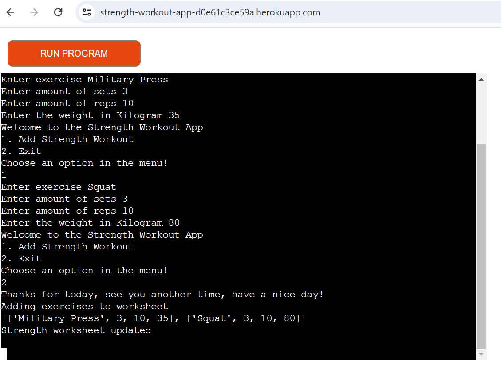
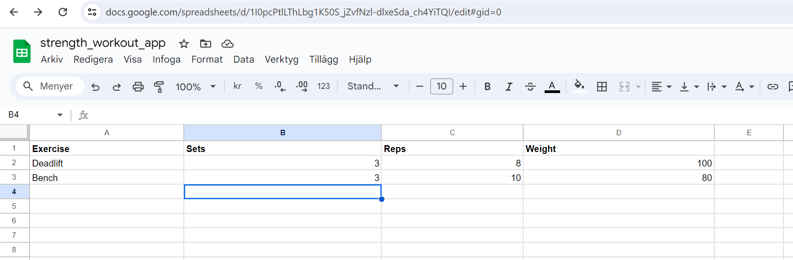
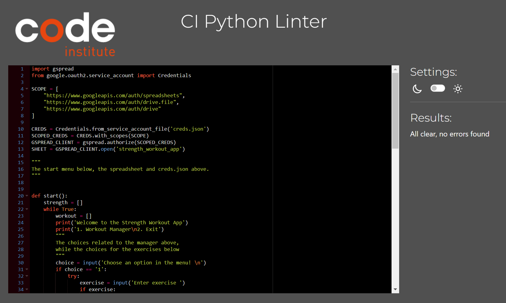
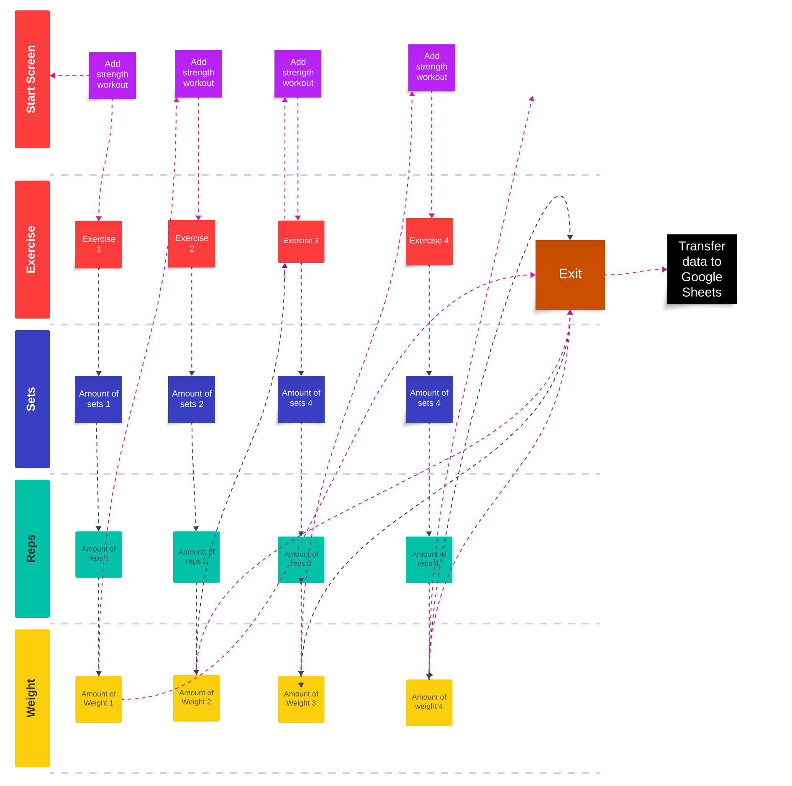

# Strength Workout App

The Strength Workout App is an application to register your workout data.
You will register the exercises, sets, reps and weight in kg to the app, which will transfer to a Google Sheet when you exit the app.

# UX
### Visitor Goals
The expected visitor is:
- Visitors that are working out with weight lifting.
- Visitors that want to have an easy way to keep track of the workout history.
- Visitors that wants to see what kind of tools is out there.

Visitors goals are:
- To be able to add your exercises including amount of sets, reps and weight.
- To keep track of their workout history
- To be able to see if they are improving

How the Strenght Workout App fills the needs:
- You can register your workouts in the app.
- You can see the data that is already in the app.
- It is very easy to use.

### Business Goals
The Business Goals are:
- To make an easy to use app.
- To be able to see and add information.
- To make it buildable with new features in the future.

### User Stories
1. As a strength trainer I want to be able to keep track of my workout data.
0. I expect it to be easy to add and retrieve data
0. I want to have an app that will get new featues in the future, so it will get even better.

### Existing Features

- __Heroku__
  - The app is uploaded on Code Institutes control panel at Heroku, there is only one screen that will be filled up.

### Thoughts behind my choices

- I wanted it to be easy with few choices, 1 to add workout and 2 to exit the app.
- I wanted all 4 inputs to be connected to each other and therefore appear when previous is filled in.
- I decided that Exercise should only have limitation on amount of characters and that I don't want it empty, so a value always exist even if
it's just a space, it is still a real value, I didn't want to limit any kind of characters because some people might want to have a number or a
special sign, even a space might be something you want but I want the user to atleast be active in choosing the space.
- For sets, reps and weight I am forcing a number, because it must be a number even if it's 0, for example weight 0 can be your bodyweight, while
0 reps could be that you can't complete a whole rep and 0 sets that you don't want to count it as a set, I don't think minus is possible on the
other hand in strenght training so therefore all minus numbers will become plus in the worksheet.
- The Google Sheets is used so you can store your data.

### Google Sheets

- Data is uploaded to Google Sheets https://docs.google.com/spreadsheets/d/1I0pcPtlLThLbg1K50S_jZvfNzl-dlxeSda_ch4YiTQI/edit#gid=0 
- I added data for 2 exercises so it is possible to see data before it is testet by Code Institute, so I would think that it will be more exercises
added in the future by external parties.

### Features Left to Implement

- Would like to make it possible to register and login in the future, instead of being for one user only today.
- Would like to insert date functions in the future where you have workouts registered on a specific day.
- Should be possible to take out statistic for a specfic day in the future.
- Want to be able to delete data from the sheet in the future.

## Testing 

- You can use the app in Chrome, Firefox and Edge without errors.
- I done a lot of testing and everything is working as it should, even if I try to cause errors.
- Tested so you can't have empty string in exercise or over 40 characters, also tested so that you can only put numbers in sets, reps and weight.

### Validator Testing 

- Python
  - No errors were returned when passing through the official [PEP8 Python Validator](https://pep8ci.herokuapp.com/#).

### Unfixed and fixed Bugs

- Don't have any unresolved bugs.
- I got help with some bugs and mostly suggestions by mentor and tutor, especially the worksheet with mentor and to make limitations for exercise variable
from tutor, it is my code but they pointed and big issues was related to indentation and that I add too much code to solve issues, so they ask me to remove code.

## Deployment

- The app was deployed to GitHub pages and Heroku. The steps to deploy are as follows: 
  - Copy the repository from GitHub to your own GitHub to have it on your GitHub.
  - Create a new app in Heroku, name it and choose your region before pushing button to create app.
  - In the next page press settings, scroll down to Config Vars and pust the button, here you add CREDS in KEY and copy and paste everything inside creds.json to Value, 
  you also add another var and put in PORT in KEY and 8000 in VALUE.
  - You will now push Add buildpack just below Config Vars, there you choose Python and press the button to add it, you will get back to settings where you
  press button to add buildpack again to add another buildpack and choose nodejs and add it also, make sure to have Python above nodejs in settings by moving it if needed.
  - Now you go up to switch to Deploy in the tab and here you press the GitHub icon with the GitHub text to connect to GitHub and after that press Connect to GitHub button below.
  - You will get a name choice where you choose your GitHub and search for the correct respository and then press connect.
  - You will now be able to press Enable Automatic Deploys to make changes come automatically so do that, but press also Deploy Branch to get access already after about 30 seconds,
  after the 30 seconds give or take depending on your internet speed and computer you can press view and now you have access to use the app.
  - Now you will also be able to find the deployment in GitHub including all commits that was done after the deployment

  - Link to the live version of the project can be found here: - https://strength-workout-app-d0e61c3ce59a.herokuapp.com/ and to the gitHub page here : https://github.com/AlexanderAberg/strength-workout-app

## Credits 

- The Tutor Holly helped me with limiting exercise variable, it is mainly my own code but with her help.
- My mentor Rory Patrick has been much help with suggestion and ideas, especially regarding my worksheet.
- Template for this README is taken from my previous project Battleship, that got it from my project Different Coloured Tea that in term got its template from Love Running and my mentors P1.
- Got inspired and used/reused some code from https://www.youtube.com/watch?v=Sx3Kw0RtmAE&ab_channel=CodeNust by Code Nust.
- Got some inspiration from perplexity AI related to while loops, but didn't use any code from it because it didn't work for me.

### Content 

- I made the app so it is easy to add the content and you will also get feedback of your data, both old and new.
- Python was taken from the Code Institute education and the project Love Sandwiches, but also used/got inspired by code from  https://www.youtube.com/watch?v=Sx3Kw0RtmAE&ab_channel=CodeNust 

### Media

- Responsive mockup from https://ui.dev/amiresponsive?url=https://alexanderaberg.github.io/battleship/ 
- Google Sheet is from https://docs.google.com/spreadsheets/d/1I0pcPtlLThLbg1K50S_jZvfNzl-dlxeSda_ch4YiTQI/edit#gid=0

### Diagram

- Used Lucid Chart for a diagram of how the app is supposed to be built up.

### Technologies Used

- Education Tool- From the people at Codeinstitute and W3 School
- Diagram - From Lucid Chart 
- Mockup - Generated at amiresponsive 
- Worksheet - From Google Sheets
- GitHub for storing the project and to get the deployed version
- Gitpod for project development
- Heroku to deploy the project